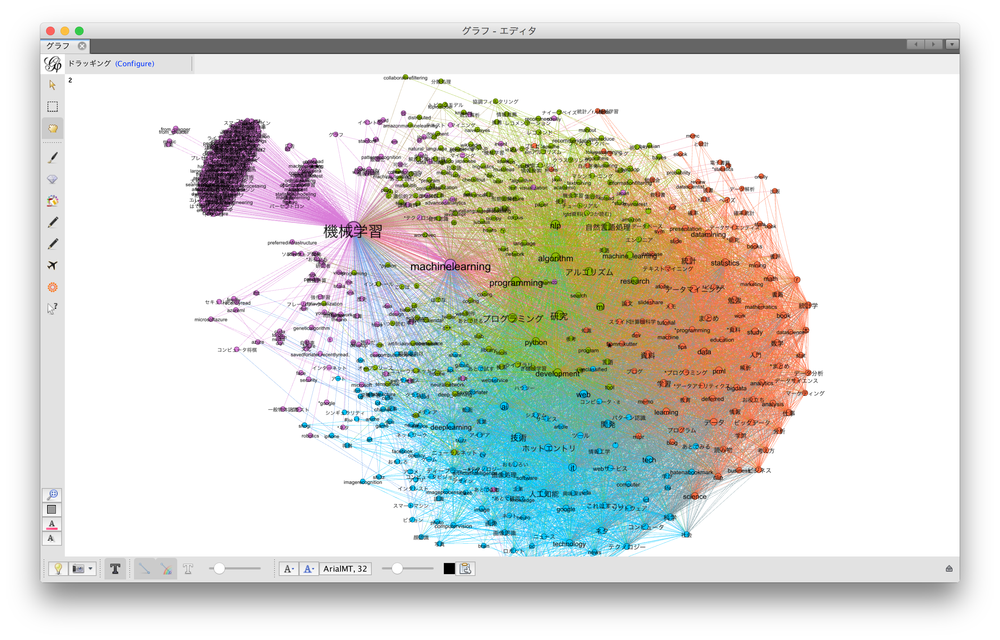
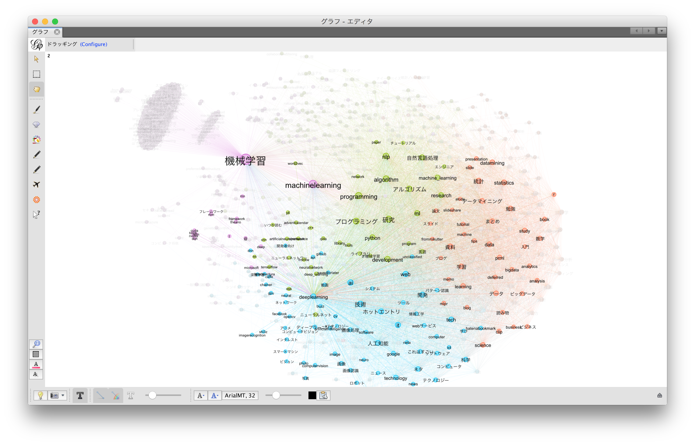
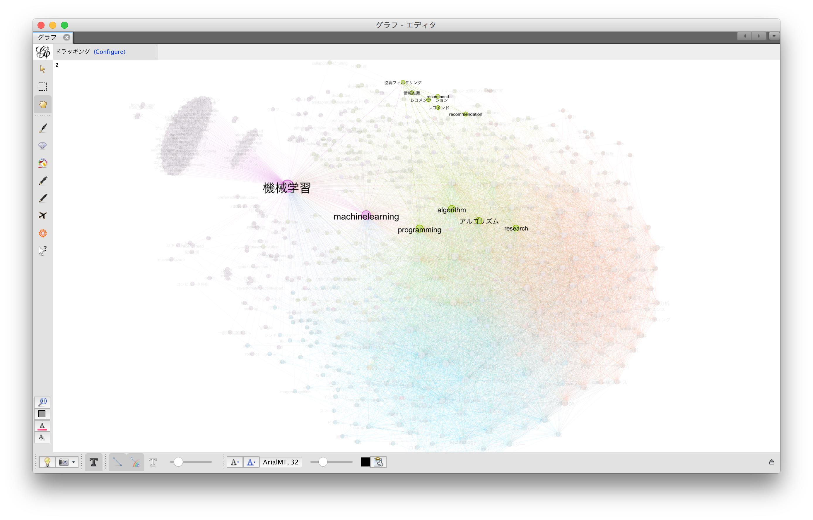
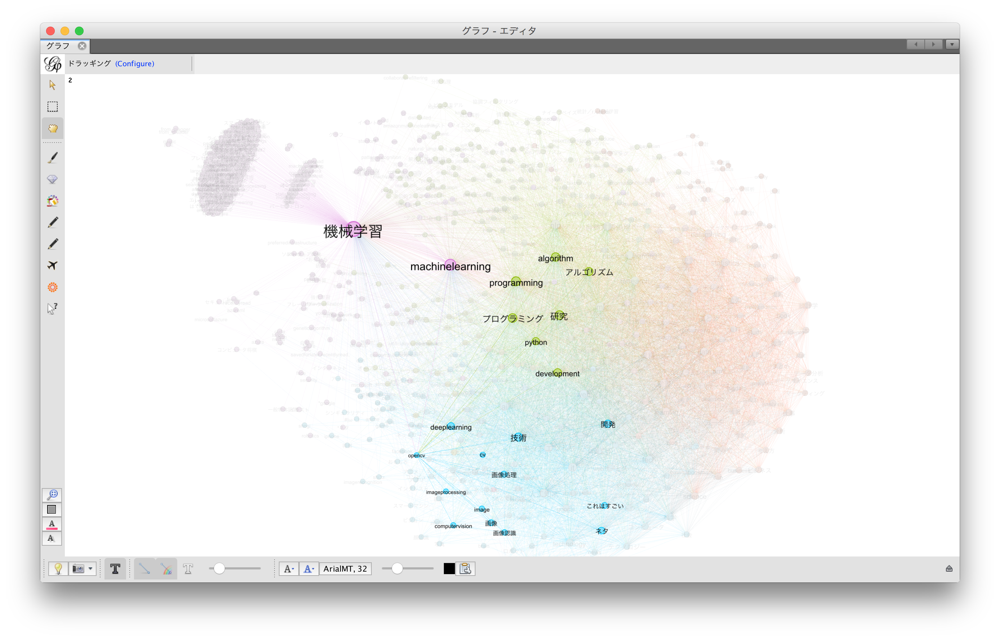

# AnalyseHatenaBookmarkTagCooccurrence
はてなブックマークの共起タグを取得し、ネットワーク表示します。  
下図は、「機械学習」タグが付いているWebページをほぼ全ページを取得し、[Gephi](http://oss.infoscience.co.jp/gephi/gephi.org/)でタグの共起ネットワーク描画しています。





## はてなブックマークからの情報取得
1. はてなブックマーク情報取得スクリプトの実行  

    ```shellscript
    python get_cooccurrence.py
    ```
    [注]  
     * 細かい設定はコマンドライン引数で渡すことができます。  
        ```shellscript
        python get_cooccurrence.py --help
        ```
        ```
        usage: get_cooccurrence.py [-h] [-d [DEST_URL_LIST]] [-D [DEST_COOCCURRENCE]]
                                   [-s [{entrylist,tag}]] [-q [FEED_QUERY]]
                                   [-f [FEED_MAX]] [-b [BOOKMARK_THRESHOLD]]
                                   [-c [COOCCURENCE_THRESHOLD]]

        This script create the CSV describing cooccurrence of tags at Hatena bookmark.

        optional arguments:
          -h, --help            show this help message and exit
          -d [DEST_URL_LIST], --dest-url-list [DEST_URL_LIST]
                                directory path where you want to create output CSV for
                                URL list (default: "./url_list.csv")
          -D [DEST_COOCCURRENCE], --dest-cooccurrence [DEST_COOCCURRENCE]
                                directory path where you want to create output CSV for
                                cooccurrence list of tags (default:
                                "./cooccurrence.csv")
          -s [{entrylist,tag}], --feed-target [{entrylist,tag}]
                                feed target for feeding webpages. "entrylist" means
                                getting all entries, and "tag" means getting only
                                entries of tagged query by "--feed-query" (default:
                                "entrylist")
          -q [FEED_QUERY], --feed-query [FEED_QUERY]
                                query for feeding webpages. this parameter make sense
                                only at "--feed-target" is "tag" (default: "")
          -f [FEED_MAX], --feed-max [FEED_MAX]
                                max page for feeding web pages (default: 10000)
          -b [BOOKMARK_THRESHOLD], --bookmark-threshold [BOOKMARK_THRESHOLD]
                                minimum bookmarks for feeding web pages (default: 100)
          -c [COOCCURENCE_THRESHOLD], --cooccurence-threshold [COOCCURENCE_THRESHOLD]
                                minimum cooccurence of tags (default: 10)
        ```
    
    * 例１：「機械学習」タグが付いているWebページを対象に5000ページ取得し、共起タグとする共起回数の下限値を3回とする場合は次の通りです。また、出力ファイル名をデフォルト_機械学習としています。
      
        ```shellscript
        python get_cooccurrence.py -s tag -q 機械学習 -c3 -f 5000 -d url_list_機械学習.csv -D cooccurrence_機械 学習.csv
        ```
          
    * 例２：はてなブックマークがついている新着のWebページを対象に1000ページ取得し、共起タグとする共起回数の下限値を10回とする場合は次の通りです。
      
        ```shellscript
        python get_cooccurrence.py -s entrylist -q 機械学習 -c10 -f 1000
        ```

2. 共起ネットワークの描画  
    以下ではRのigraphライブラリを用いて共起ネットワークを描画します。  
    ノード数が1000を超えるくらい大きなネットワークの場合、適切に描画できません。  
    この場合、[Gephi](http://oss.infoscience.co.jp/gephi/gephi.org/)等のアプリケーションを用いることを推薦します。

    1. Rの実行

        ```
        R
        ```

    2. 共起ネットワークの描画
        ```Rscript
        library(igraph)
        csvdata <- read.csv("./cooccurrence.csv", head = T)
        graphdata <- graph.data.frame(csvdata, directed = F)
        tkplot(
          graphdata,
          vertex.label=V(graphdata)$name,
          canvas.width = 1200,
          canvas.height = 700,
          vertex.size = 0,
          edge.width=E(graphdata)$freq/4)
        ```
